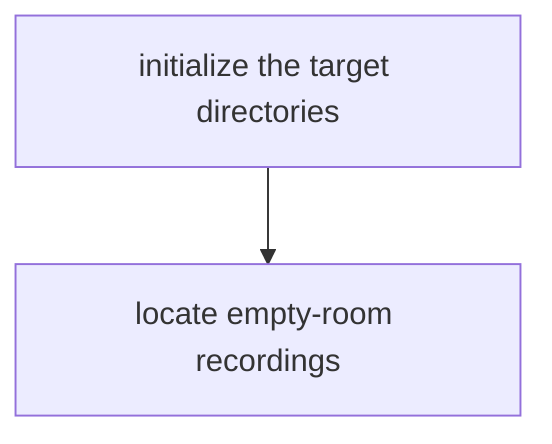
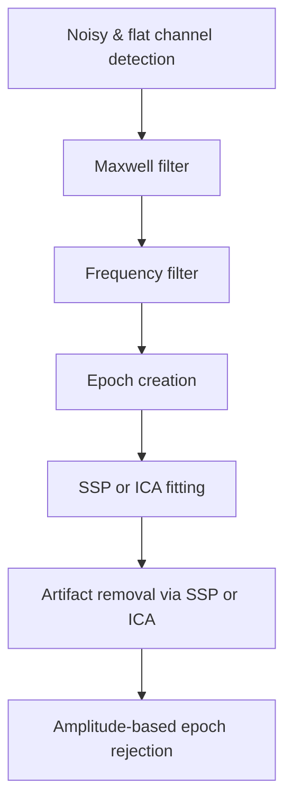
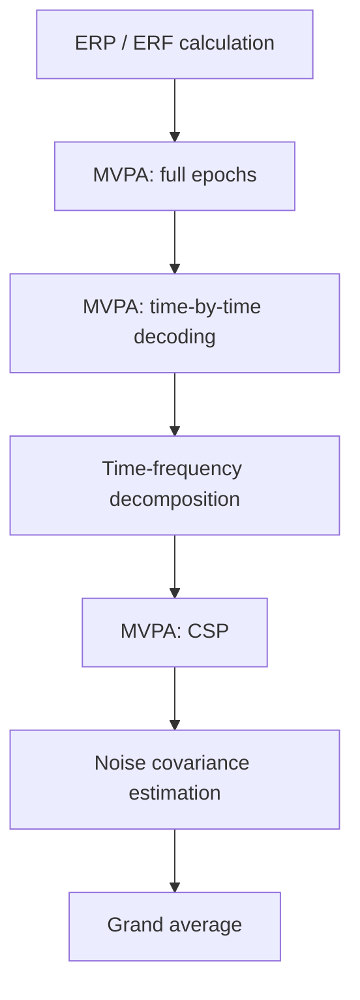
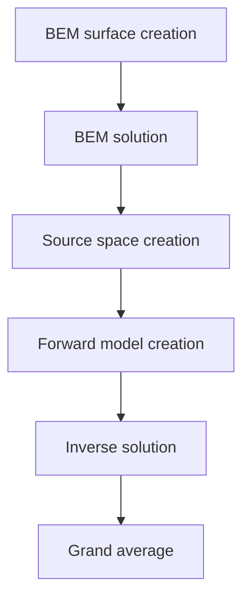

MNE-BIDS-Pipeline processes your data in a sequential manner, i.e., one step
at a time. The next step is only run after the previous steps have been
successfully completed. There are, of course, exceptions; for example, if you
chose not to apply ICA, the respective steps will simply be omitted and we'll
directly move to the subsequent steps. The following flow chart aims to give
you a brief overview of which steps are included in the pipeline, in which
order they are run, and how we group them together.

!!! info
    All intermediate results are saved to disk for later
    inspection, and an **extensive report** is generated.

!!! info
    Analyses are conducted on individual (per-subject) as well as group level.

## :open_file_folder: Filesystem initialization and dataset inspection

## :broom: Preprocessing

## :satellite: Sensor-space processing

## :brain: Source-space processing

